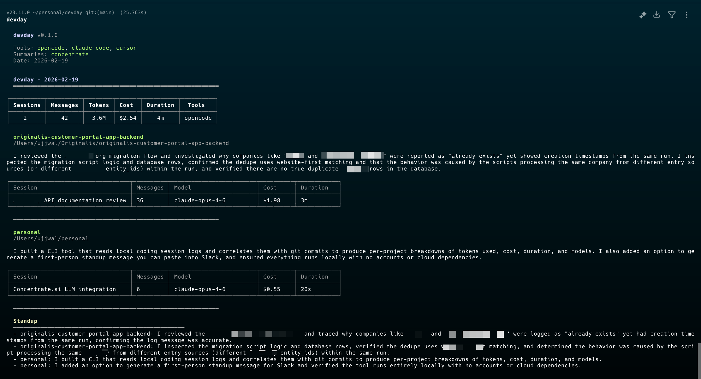

# devday

End-of-day recap for AI-assisted coding sessions. Reads your local conversations from OpenCode, Claude Code, Cursor, and Codex, cross-references with git, and generates standup-ready summaries.



## What it does

- Scans completed AI coding sessions from your local machine (nothing leaves your machine unless you enable LLM summaries)
- Shows tokens used, estimated cost, duration, and models per session
- Groups sessions by project and shows git commits alongside
- Optionally generates first-person standup messages via [Concentrate AI](https://concentrate.ai/?utm_source=fzm&utm_medium=gh&utm_campaign=ujhj), OpenAI, or Anthropic

## Supported tools

| Tool | Data source |
|------|------------|
| OpenCode | `~/.local/share/opencode/storage/` |
| Claude Code | `~/.claude/` (SQLite + JSONL) |
| Cursor | `~/Library/Application Support/Cursor/User/globalStorage/state.vscdb` |
| Codex | `~/.codex/sessions/` (JSONL + legacy JSON) |
| Gemini CLI | WIP |

## Install

```bash
npm install -g devday
```

## Development

```bash
git clone https://github.com/ujjwaljainnn/devday.git
cd devday
npm install
npm run build
npm link
```

## Usage

```bash
devday                        # today's recap
devday -d yesterday           # yesterday
devday -d 2026-02-11          # specific date
devday --standup              # short standup format
devday --json                 # machine-readable output
devday --no-git               # skip git integration
devday --no-summarize         # skip LLM summaries
devday -v                     # debug output
```

## AI summaries

Summaries are optional. Without an API key, devday shows stats and git only.

```bash
export CONCENTRATE_API_KEY=sk-cn-...
# or
export OPENAI_API_KEY=sk-...
export ANTHROPIC_API_KEY=sk-...

# optional: enrich standup with Linear ticket context via MCP
export LINEAR_MCP_SERVER_URL=https://your-linear-mcp-server.example.com/mcp
export LINEAR_MCP_AUTH_TOKEN=lin_...
```

### Concentrate AI

[Concentrate AI](https://concentrate.ai/?utm_source=fzm&utm_medium=gh&utm_campaign=ujhj) is a unified LLM gateway that routes to 50+ models (GPT-5, Claude, Gemini, etc.) through a single API key. devday uses it with `gpt-5-mini` for fast, cheap summarization.

**$20 in free credits** when you [sign up](https://concentrate.ai/?utm_source=fzm&utm_medium=gh&utm_campaign=ujhj) — more than enough to run devday for months.

### Linear MCP (optional)

If `LINEAR_MCP_SERVER_URL` is set, devday enables a Linear MCP tool during standup generation. The summarizer will try to pull:
- tickets created on the recap date
- tickets closed/completed on the recap date (or previous day if needed)
- currently assigned tickets
- active/in-progress tickets

When data is available, standup output may include bullets like `Things I'm working on` and `Things I'm planning to work on`.

## How it works

devday reads completed sessions from each tool's local storage. Sessions are grouped by project directory, and git commits are matched by date.

Duration is calculated from actual message processing times (not wall-clock), capped at 5 minutes per message to handle tools that write bogus completion timestamps.

Cost is estimated from token counts and model pricing tables when the tool doesn't provide it directly.

## Contributing

Contributions are welcome. Fork the repo, make your changes, and open a PR.

If you use this tool and think it can be better — parsers for new tools, better summaries, new output formats, whatever — send it through. Let's make this thing more useful.
